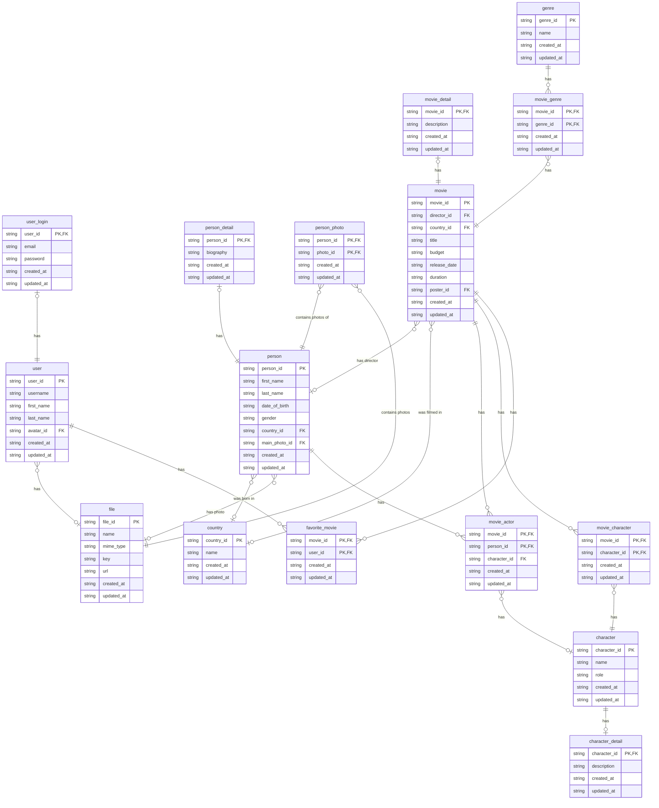

```mermaid
erDiagram
    file {
        string file_id PK
        string name
        string mime_type
        string key
        string url
        string created_at
        string updated_at
    }
    user {
        string user_id PK
        string username
        string first_name
        string last_name
        string avatar_id FK
        string created_at
        string updated_at
    }
    user_login {
        string user_id PK, FK
        string email
        string password
        string created_at
        string updated_at
    }
    country {
        string country_id PK
        string name
        string created_at
        string updated_at
    }
    person {
        string person_id PK
        string first_name
        string last_name
        string date_of_birth
        string gender
        string country_id FK
        string main_photo_id FK
        string created_at
        string updated_at
    }
    person_detail {
        string person_id PK, FK
        string biography
        string created_at
        string updated_at
    }
    person_photo {
        string person_id PK, FK
        string photo_id PK, FK
        string created_at
        string updated_at
    }
    movie {
        string movie_id PK
        string director_id FK
        string country_id FK
        string title
        string budget
        string release_date
        string duration
        string poster_id FK
        string created_at
        string updated_at
    }
    movie_detail {
        string movie_id PK, FK
        string description
        string created_at
        string updated_at
    }
    genre {
        string genre_id PK
        string name
        string created_at
        string updated_at
    }
    movie_genre {
        string movie_id PK, FK
        string genre_id PK, FK
        string created_at
        string updated_at
    }
    character {
        string character_id PK
        string name
        string role
        string created_at
        string updated_at
    }
    character_detail {
        string character_id PK, FK
        string description
        string created_at
        string updated_at
    }
    movie_actor {
        string movie_id PK, FK
        string person_id PK, FK
        string character_id FK
        string created_at
        string updated_at
    }
    movie_character {
        string movie_id PK, FK
        string character_id PK, FK
        string created_at
        string updated_at
    }
    favorite_movie {
        string movie_id PK, FK
        string user_id PK, FK
        string created_at
        string updated_at
    }
    user o{--|o file : has
    user_login |o--|| user : has
    person o{--|o country : "was born in"
    person o{--|o file : "has photo"
    person_detail |o--|| person : has
    person_photo }o--|| person : "contains photos of"
    person_photo }o--|| file : "contains photos"
    movie }o--o| person : "has director"
    movie }o--o| country : "was filmed in"
    movie_detail |o--|| movie : "has"
    genre ||--o{ movie_genre : "has"
    movie_genre }o--|| movie : "has"
    character ||--o| character_detail : has
    movie_actor }o--o| character : has
    movie ||--o{ movie_actor : has
    person ||--o{ movie_actor : has
    movie_character }o--|| character : has
    movie ||--o{ movie_character : has
    movie ||--o{ favorite_movie : "has"
    user ||--o{ favorite_movie : "has"
```