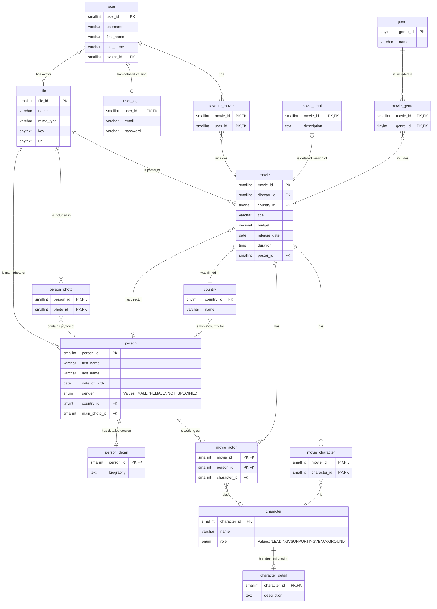

Please note: all tables also include created_at and updated_at fields additionally to specified fields.

```mermaid
erDiagram
    file {
        smallint file_id PK
        varchar name
        varchar mime_type
        tinytext key
        tinytext url
    }
    user {
        smallint user_id PK
        varchar username
        varchar first_name
        varchar last_name
        smallint avatar_id FK
    }
    user_login {
        smallint user_id PK, FK
        varchar email
        varchar password
    }
    country {
        tinyint country_id PK
        varchar name
    }
    person {
        smallint person_id PK
        varchar first_name
        varchar last_name
        date date_of_birth
        enum gender "Values: 'MALE','FEMALE','NOT_SPECIFIED'"
        tinyint country_id FK
        smallint main_photo_id FK
    }
    person_detail {
        smallint person_id PK, FK
        text biography
    }
    person_photo {
        smallint person_id PK, FK
        smallint photo_id PK, FK
    }
    movie {
        smallint movie_id PK
        smallint director_id FK
        tinyint country_id FK
        varchar title
        decimal budget
        date release_date
        time duration
        smallint poster_id FK
    }
    favorite_movie {
        smallint movie_id PK, FK
        smallint user_id PK, FK
    }
    movie_detail {
        smallint movie_id PK, FK
        text description
    }
    genre {
        tinyint genre_id PK
        varchar name
    }
    movie_genre {
        smallint movie_id PK, FK
        tinyint genre_id PK, FK
    }
    character {
        smallint character_id PK
        varchar name
        enum role "Values: 'LEADING','SUPPORTING','BACKGROUND'"
    }
    character_detail {
        smallint character_id PK, FK
        text description
    }
    movie_actor {
        smallint movie_id PK, FK
        smallint person_id PK, FK
        smallint character_id FK
    }
    movie_character {
        smallint movie_id PK, FK
        smallint character_id PK, FK
    }
    user ||--o| user_login : "has detailed version"
    file ||--o{ person_photo : "is included in"
    file |o--o{ person : "is main photo of"
    file |o--o{ movie : "is poster of"
    user }o--o| file : "has avatar"
    person_photo }o--|| person : "contains photos of"
    user ||--o{ favorite_movie : has
    favorite_movie }o--|| movie : "includes"
    person ||--o| person_detail : "has detailed version"
    movie }o--o| person : "has director"
    country |o--o{ person : "is home country for"
    movie }o--|| country : "was filmed in"
    movie ||--o{ movie_character : has
    person ||--o{ movie_actor : "is working as"
    movie ||--o{ movie_actor : has
    movie_actor }o--o| character : plays
    movie_character }o--|| character : is
    character ||--o| character_detail : "has detailed version"
    movie_detail |o--|| movie : "is detailed version of"
    genre ||--o{ movie_genre : "is included in"
    movie_genre }o--|| movie : includes
```